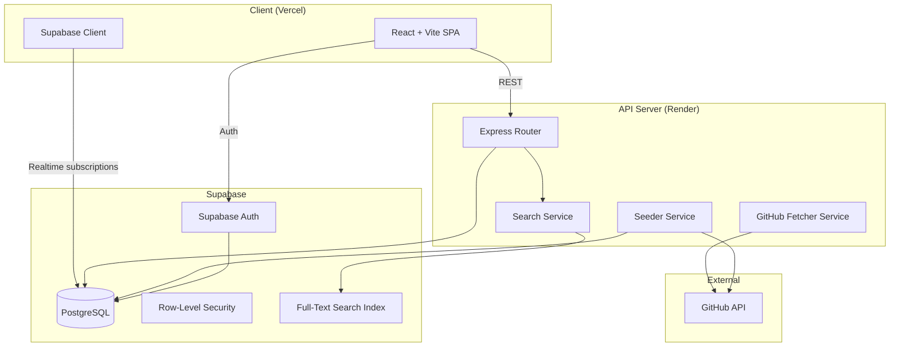
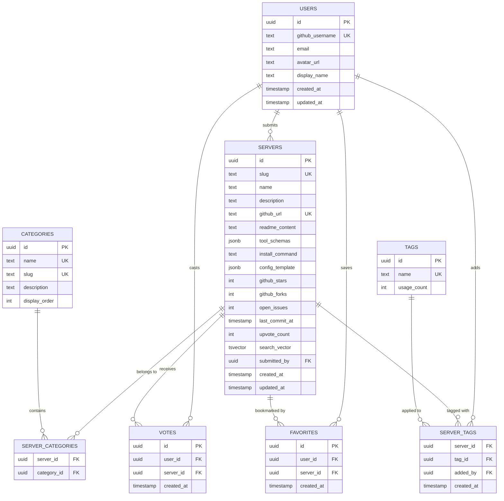

# Design: MCP Discovery Registry

## Overview
A React SPA frontend communicates with an Express API backend. Supabase provides PostgreSQL storage, authentication (GitHub OAuth), and row-level security. The API server handles GitHub metadata fetching, search indexing, and business logic. The frontend is deployed to Vercel; the backend to Render.

## Architecture



## Components and Interfaces

### Frontend Components

| Component | Responsibility |
|---|---|
| `SearchBar` | Text input with debounced search, category/tag filters |
| `ServerCard` | Compact server preview: name, description, stars, upvotes, tags |
| `ServerProfile` | Full detail page: README, tools, health signals, config generator |
| `CategorySidebar` | Navigable category tree |
| `TrendingSection` | Home page trending servers carousel |
| `ConfigGenerator` | Generates and copies mcpServers JSON for Claude/Cursor |
| `SubmitForm` | GitHub URL input with validation and auto-fetch |
| `AuthButton` | GitHub OAuth sign-in/sign-out |
| `UserProfile` | Favorites list, submission history |
| `TagInput` | Autocomplete tag adder with validation |

### Backend Services

| Service | Responsibility |
|---|---|
| `SearchService` | Builds and executes PostgreSQL full-text queries, ranking |
| `GitHubFetcherService` | Fetches repo metadata, README, stars, issues from GitHub API |
| `ServerService` | CRUD operations for MCP server records |
| `VoteService` | Upvote/remove vote with deduplication |
| `FavoriteService` | Add/remove favorites per user |
| `TagService` | Create/associate tags, enforce format |
| `SeederService` | Bulk import servers from official registry + GitHub |
| `TrendingService` | Compute composite scores with time-decay |

## Data Models



### Key Indexes
- `servers.search_vector` — GIN index for full-text search
- `servers.slug` — unique index for SEO URLs
- `votes(user_id, server_id)` — unique composite (one vote per user per server)
- `favorites(user_id, server_id)` — unique composite
- `server_tags(server_id, tag_id)` — unique composite (no duplicate tags)
- `servers.upvote_count` — B-tree for sorting by popularity

## API Design

### Public Endpoints (no auth required)

| Method | Path | Description |
|---|---|---|
| `GET` | `/api/v1/servers` | List/search servers (query, category, tags, sort, page) |
| `GET` | `/api/v1/servers/:slug` | Get server detail |
| `GET` | `/api/v1/categories` | List all categories |
| `GET` | `/api/v1/tags` | List popular tags |
| `GET` | `/api/v1/trending` | Get trending servers |

### Authenticated Endpoints

| Method | Path | Description |
|---|---|---|
| `POST` | `/api/v1/servers` | Submit a new server (GitHub URL) |
| `POST` | `/api/v1/servers/:id/vote` | Toggle upvote |
| `POST` | `/api/v1/servers/:id/favorite` | Toggle favorite |
| `POST` | `/api/v1/servers/:id/tags` | Add a tag to a server |
| `GET` | `/api/v1/me/favorites` | List current user's favorites |
| `GET` | `/api/v1/me/submissions` | List current user's submissions |

### Request/Response Examples

**GET `/api/v1/servers?q=postgres&category=databases&sort=trending&page=1`**
```json
{
  "data": [
    {
      "id": "uuid",
      "slug": "supabase-mcp-server",
      "name": "Supabase MCP Server",
      "description": "MCP server for Supabase database operations",
      "github_stars": 234,
      "upvote_count": 45,
      "last_commit_at": "2026-03-28T10:00:00Z",
      "categories": ["databases"],
      "tags": ["postgresql", "read-write"],
      "is_voted": false,
      "is_favorited": true
    }
  ],
  "meta": { "page": 1, "total": 42, "per_page": 20 }
}
```

**POST `/api/v1/servers`**
```json
// Request
{ "github_url": "https://github.com/org/mcp-server-name" }

// Response 201
{
  "id": "uuid",
  "slug": "mcp-server-name",
  "name": "MCP Server Name",
  "github_stars": 120,
  "status": "active"
}
```

### Error Response Format
```json
{
  "error": {
    "code": "DUPLICATE_SERVER",
    "message": "This server is already registered.",
    "status": 409
  }
}
```

## Error Handling Strategy
- **API layer**: Express error middleware catches all thrown errors, returns consistent JSON error format.
- **Validation**: Zod schemas validate all request bodies at the route handler level.
- **GitHub API failures**: Retry with exponential backoff (max 3 attempts). Return 502 if GitHub is unreachable.
- **Auth failures**: Return 401 with redirect hint. Frontend redirects to login.
- **Rate limiting**: 100 req/min per IP for public endpoints, 30 req/min for write endpoints per user.

## Testing Strategy
- **Unit tests**: Vitest for both client and server. Service layer logic, utility functions, search ranking.
- **Integration tests**: API route tests with a test Supabase instance. Drizzle migrations tested against real PostgreSQL.
- **Component tests**: React Testing Library for key UI components (SearchBar, ServerCard, ConfigGenerator).
- **E2E tests**: Playwright for critical flows (search, view profile, copy config, submit server, vote).
- **Coverage target**: 80%+ on server services, 70%+ on client components.

## Security Architecture

### Threat Model

| Threat | Vector | Likelihood | Impact | Mitigation |
|---|---|---|---|---|
| Account takeover | OAuth token theft | Low | High | Supabase Auth handles token rotation; HTTPS only |
| Vote manipulation | Scripted upvotes | Medium | Medium | One vote per user (DB constraint); rate limiting |
| XSS | Rendered README content | Medium | High | DOMPurify sanitization on all Markdown rendering |
| Injection | Search queries | Medium | High | Parameterized queries via Drizzle ORM |
| IDOR | Direct object access | Low | Medium | Row-Level Security policies on all user-owned data |
| Spam submissions | Bulk server submissions | Medium | Low | Rate limiting + GitHub URL validation |

### Security Defaults
- Supabase Auth manages all session tokens — no custom JWT implementation.
- RLS policies on `votes`, `favorites`, `server_tags` — users can only modify their own records.
- All user-generated Markdown sanitized with DOMPurify before rendering.
- CORS restricted to frontend domain only.
- GitHub tokens stored as server-side env vars, never exposed to client.
- Content Security Policy headers on all responses.

## Scalability and Performance
- **Expected load**: ~1000 DAU initially, growing to 10K+ DAU.
- **Read/write ratio**: 95/5 — heavily read. Aggressive caching appropriate.
- **Caching**: Server list responses cached with 60s TTL (Redis or in-memory). Server profiles cached with 5min TTL. GitHub metadata refreshed every 6 hours via cron.
- **Search**: PostgreSQL tsvector with GIN index. Sufficient for 10K servers. Migrate to dedicated search (Typesense/Meilisearch) if needed beyond 50K.
- **API p95 target**: <200ms for list endpoints, <100ms for cached responses.
- **Static assets**: Served via Vercel CDN with immutable cache headers.

## Dependencies and Risks

| Dependency | Risk | Mitigation |
|---|---|---|
| GitHub API | Rate limits (5000/hr authenticated) | Cache aggressively; batch fetches; use conditional requests (ETag) |
| Supabase | Vendor lock-in | Drizzle ORM abstracts DB layer; standard PostgreSQL features only |
| Supabase Auth | OAuth provider dependency | Standard OAuth — can migrate to Auth.js if needed |
| Vercel free tier | Build minute limits | Optimize build; upgrade tier if needed |
| Render free tier | Cold starts on free plan | Use paid tier for API if latency matters; health check endpoint |

### ADR-1: Monorepo with Separate Client/Server Packages

**Status:** Accepted
**Context:** Need to share types between frontend and backend while keeping deployment independent.
**Options Considered:**
- Option A: Single package — Pro: simple. Con: coupled deploys, bloated bundles.
- Option B: Monorepo with `client/` and `server/` — Pro: shared types via workspace, independent deploys. Con: slightly more config.
**Decision:** Option B. npm workspaces with shared `types/` package.
**Consequences:** Need workspace-aware scripts. Shared types must be imported, not duplicated.

### ADR-2: PostgreSQL Full-Text Search Over Dedicated Search Engine

**Status:** Accepted
**Context:** Need to search across server names, descriptions, README content, and tool schemas.
**Options Considered:**
- Option A: Meilisearch/Typesense — Pro: better relevance, typo tolerance. Con: extra infra, cost, sync complexity.
- Option B: PostgreSQL tsvector + GIN — Pro: zero extra infra, transactionally consistent, free. Con: less sophisticated ranking.
**Decision:** Option B for Phase 1. The registry will have <10K servers initially — Postgres FTS is sufficient. Revisit at 50K+ servers.
**Consequences:** Must maintain `search_vector` column via trigger. Custom ranking function needed for composite scoring.

### ADR-3: Supabase Auth Over Custom Auth

**Status:** Accepted
**Context:** Need GitHub OAuth for developer sign-in.
**Options Considered:**
- Option A: Custom OAuth + JWT — Pro: full control. Con: security risk surface, session management complexity.
- Option B: Supabase Auth — Pro: managed, secure, built-in GitHub provider, RLS integration. Con: Supabase coupling.
**Decision:** Option B. Reduces security surface and development time significantly.
**Consequences:** Auth flow tied to Supabase client library. JWT verification on API server uses Supabase JWT secret.
