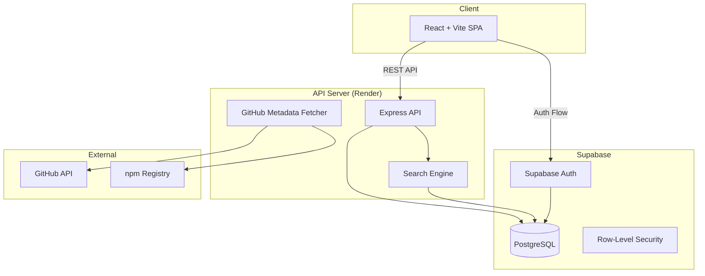

# MCP Discovery Registry — Project Plan

## Goal
Build a universal, community-driven platform for discovering, evaluating, and integrating MCP servers — solving the fragmentation, trust, and integration friction in the MCP ecosystem.

## Constraints
- React + Vite + TailwindCSS frontend
- Node.js backend (Express or similar)
- Supabase (PostgreSQL) for database, auth, and real-time features
- npm package manager
- Frontend deployed to Vercel, backend to Render if needed
- GitHub API integration for server metadata (stars, commits, issues)
- Must handle 100+ seeded servers at launch

## Tech Stack Rationale

| Layer | Choice | Why |
|---|---|---|
| Frontend | React + Vite + TailwindCSS | Fast dev cycle, excellent component ecosystem, responsive design |
| Backend | Node.js + Express | Unified JS stack, robust API capabilities, npm ecosystem |
| Database | Supabase (PostgreSQL) | Managed Postgres, built-in auth, real-time subscriptions, row-level security |
| Auth | Supabase Auth (OAuth) | GitHub OAuth for developer-friendly login, built-in session management |
| Search | PostgreSQL full-text search + tsvector | Sufficient for initial scale, no extra infra needed |
| ORM | Drizzle ORM | Type-safe, lightweight, excellent Postgres support |
| Hosting | Vercel (frontend) + Render (API) | Free tiers, easy CI/CD, good DX |

## Architecture



## File/Folder Structure

```
mcp-discovery-registry/
├── .claude/                    # Claude Code config (junctions to kit)
├── .github/                    # GitHub config + Copilot instructions
├── .spec/                      # Planning artifacts
│   ├── plan.md
│   ├── requirements.md
│   ├── design.md
│   ├── tasks.md
│   └── tasks/                  # Individual task files
├── client/                     # React frontend
│   ├── src/
│   │   ├── components/         # Reusable UI components
│   │   ├── pages/              # Route-level pages
│   │   ├── hooks/              # Custom React hooks
│   │   ├── lib/                # Supabase client, API client, utils
│   │   ├── types/              # TypeScript type definitions
│   │   └── App.tsx
│   ├── index.html
│   ├── vite.config.ts
│   └── package.json
├── server/                     # Express API backend
│   ├── src/
│   │   ├── routes/             # API route handlers
│   │   ├── services/           # Business logic (search, GitHub fetch, etc.)
│   │   ├── db/                 # Drizzle schema, migrations
│   │   ├── middleware/         # Auth, validation, error handling
│   │   └── index.ts
│   └── package.json
├── .env.example
├── .gitignore
└── package.json                # Root workspace config
```

## Core Features (Phase 1)
1. **Discovery & Search** — semantic search across server names, descriptions, tool schemas, README content
2. **Rich Server Profiles** — rendered README, tool inventory with schemas, GitHub health signals
3. **One-Click Config** — generate mcpServers JSON for Claude Desktop / Cursor
4. **Community Signals** — upvotes, favorites, user-contributed tags
5. **User Submissions** — submit MCP servers via GitHub URL with automated metadata extraction
6. **Category Navigation** — domain-based categorization (Databases, Productivity, DevTools, etc.)
7. **Trending & Ranking** — multi-signal ranking (upvotes, stars, activity, recency)

## Future Roadmap (Phase 2+)
- Private enterprise registries with RBAC
- Security scanning for published servers
- Health checks / automated pings
- Public API for programmatic discovery
- Usage analytics for enterprise teams
